# 👋 Hello World! Welcome to SwiftEval
SwiftEval is a better way for students to fill out the Trilogy Education Services student evaluation form, as the app saves the data for next time, the form can be filled with ease at the click of a button!

Link: https://ali-row.github.io/SwiftEval/

### Here's how it works:

Once you open up the app you will be presented with a slick user interface.

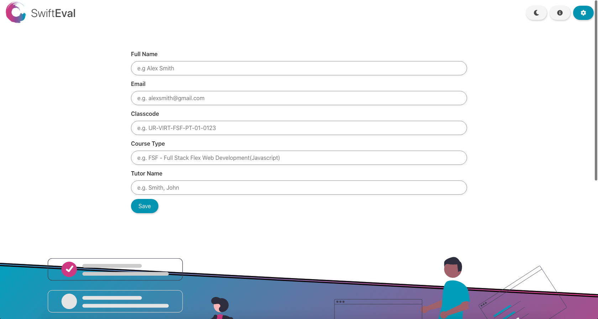

To begin simply fill out the form.

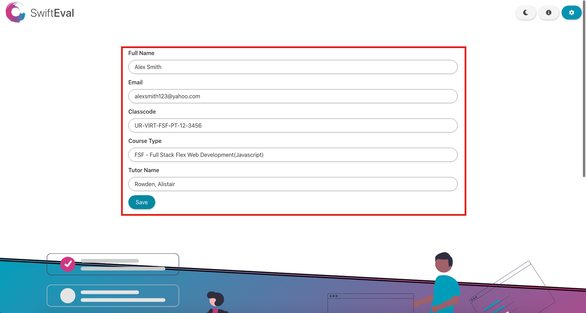

**Pay close attention to how you fill out the form, as google forms is super picky about typos and casing issues, if you don't fill things out correctly it wont fill out the google form in its entirety.**

Step 1)  
Fill out your full name.

Step 2)  
Fill out your email.

Step 3)  
Fill out your classcode.
(This can be sent to you by your tutor if you don't remember it.)

Step 4)  
Pick your coursetype from the dropdown menu (A brand new feature as of 2021!)

Step 5)   
Fill out your tutors name, starting the last name then the first name.
**Again this must be written exactly like it is written in the google form.**
ie. If your tutors name is John Smith, then you would type
**Smith, John**

Step 6)  
Click on the save button!

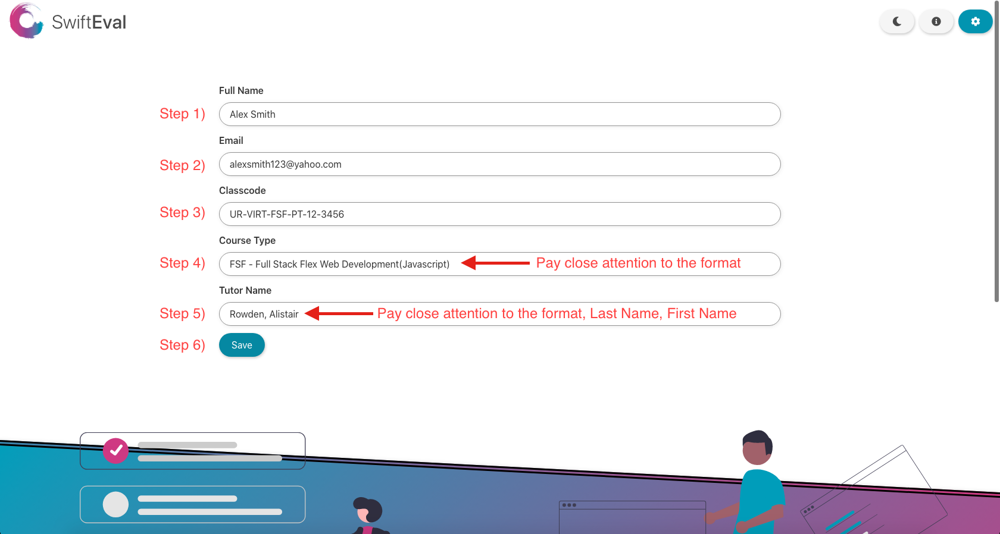

Now you'll be greeted with the welcome page, you can simply click on the generate form button and it will generate the autofilled google form.

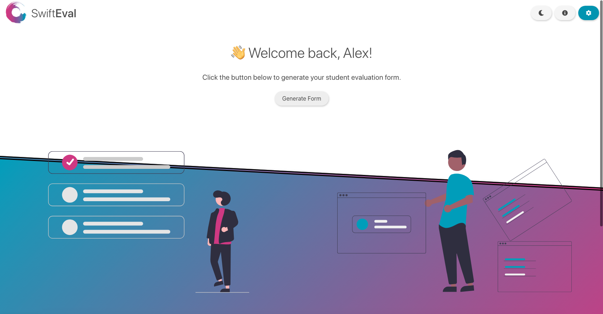

And hey presto, notice how everything on the first page of the evaluation form is complete, including the current date and a few extra checkboxes, this is a **HUGE** time saver!

Each time you visit SwiftEval from now on your info will be saved for next time!

FYI, all of the data collected by this app is stored in your browsers Local Storage meaning that the data is yours and yours only, no one will be able to see the data you save with this app which protects your privacy, with this application privacy comes first!

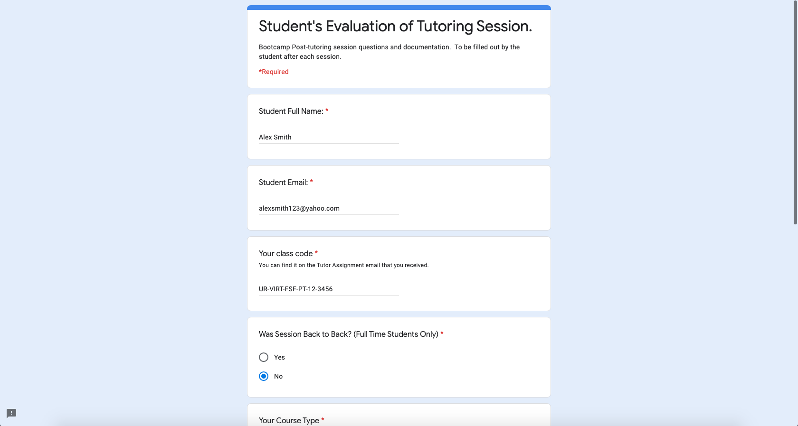
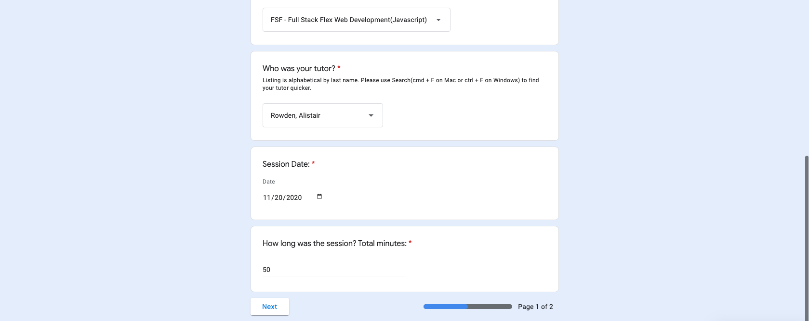

If for some reason the form didn't autofill everything you may have typed something incorrectly, not to worry however, simply click on the profile settings button in the top right corner.

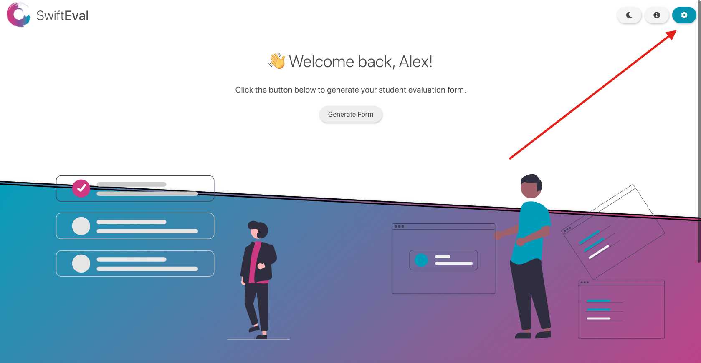

Then click on the update info button at the bottom.

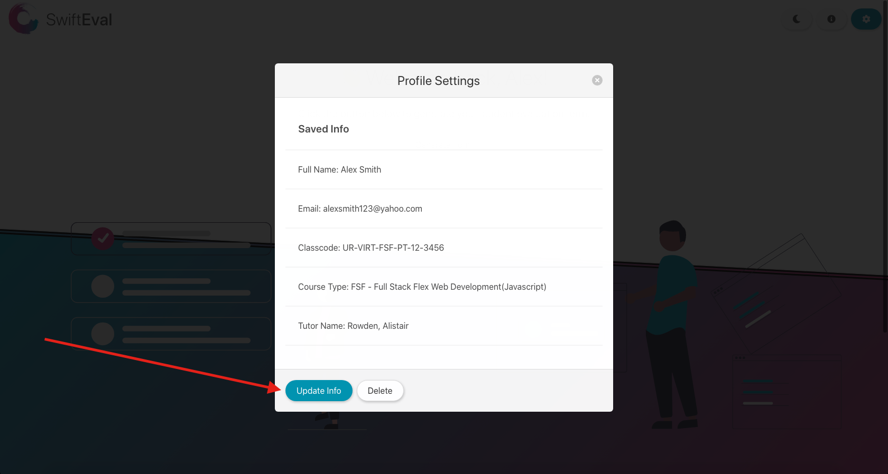

Notice how your current info is in the form already, simply edit the incorrect field(s) and click save again.

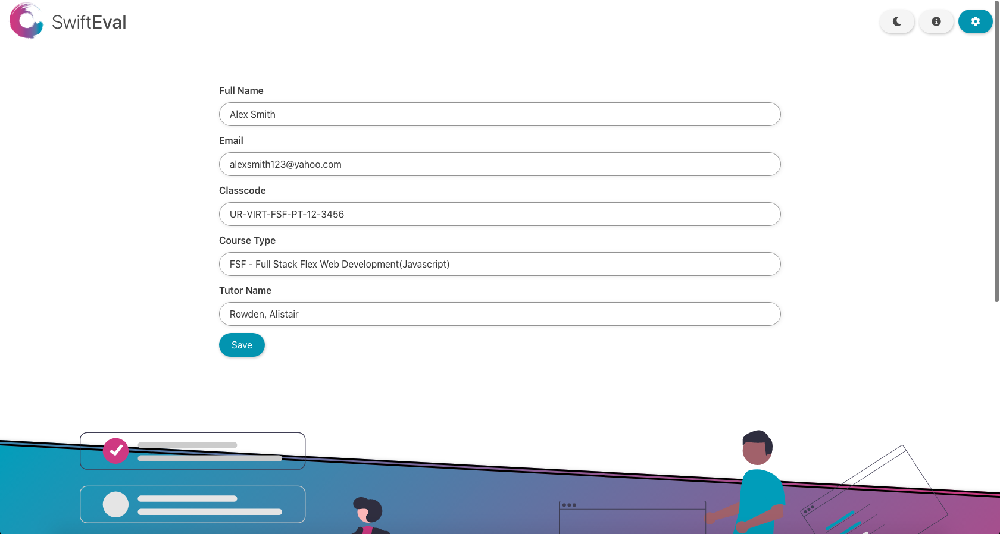

If you'd like to delete your info and start over you can simply click on the delete button.

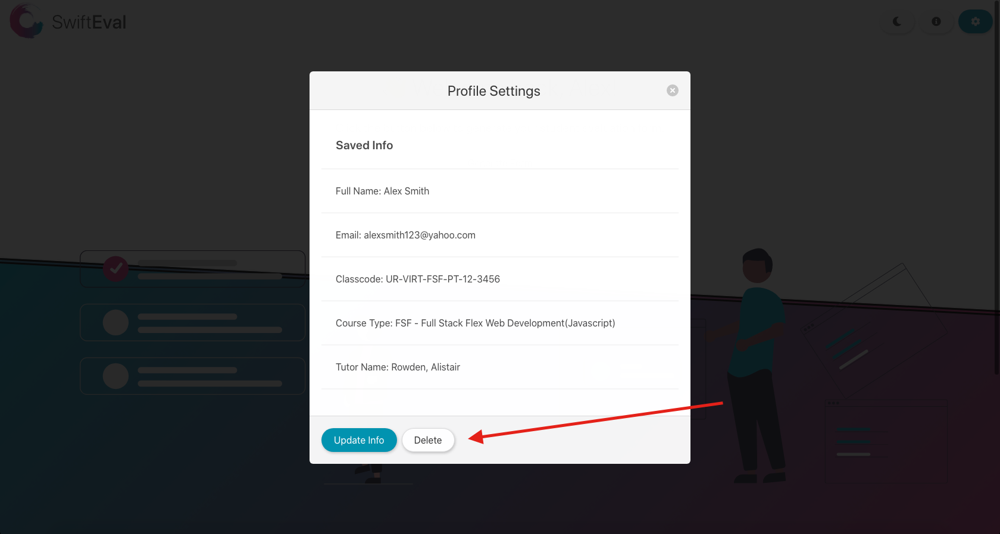

And lastly maybe try dark mode, you might prefer it? 😉

You'll notice that your dark mode settings are also remembered the next time you fire up SwiftEval!

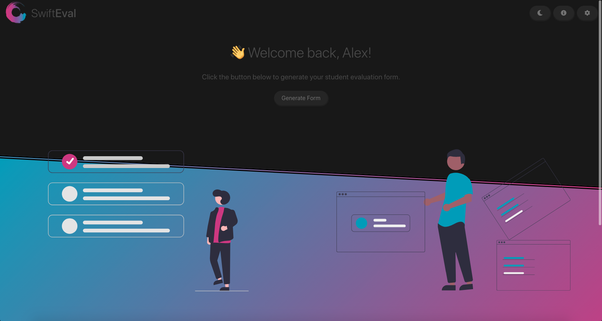

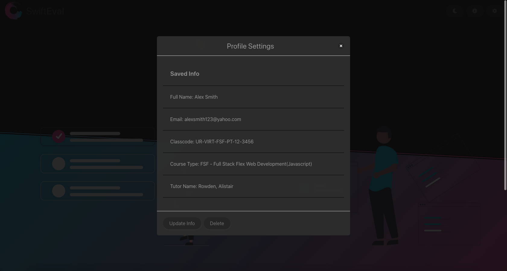

And there you have it, I hope this app helps all of the Trilogy Boot Camp students and makes their lives a little easier.

Please feel free to contribute to the project on Github if you have any ideas or improvements, that would be awesome!

Thanks.

Alistair Rowden, Senior Full Stack Tutor

